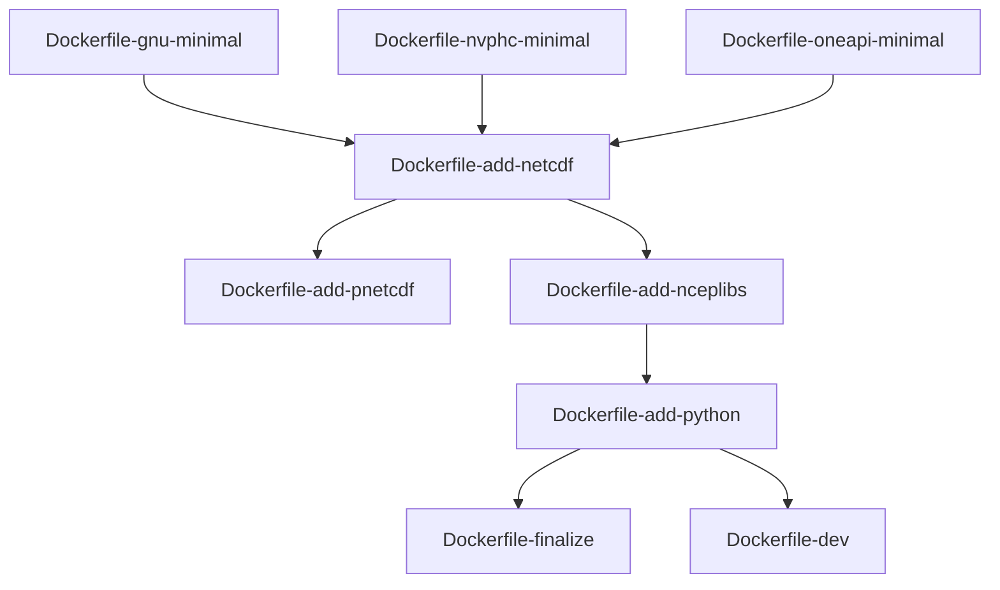

# Docker

## Build
To build the Docker image
```bash
$ make
or
$ make build
```

## Run
To run the SCM in Docker with its source directory mounted, run `make run` and copy the Docker command it prints.

```bash
$ make run
From the top directory run
docker run --rm -it --user "$(id -u):$(id -g)" --env HOME=/tmp -v "${PWD}/../:/src" -w /src scm-gnu:latest
$ docker run --rm -it --user "$(id -u):$(id -g)" --env HOME=/tmp  -v "${PWD}/../:/src" -w /src scm-gnu:latest
```


## Clean
To remove the images

```bash
$ make clean
```

Check images
```bash
$ docker images
```

## Image Dependency Graph


