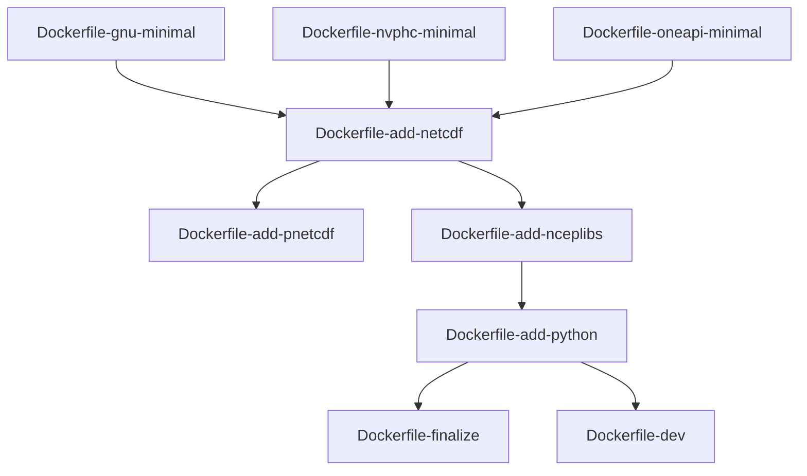

# Docker

## Build
To build the Docker image
```bash
$ make
or
$ make build
```

## Run
To run the SCM in Docker with its source directory mounted, run `make run` and copy the Docker command it prints.

```bash
$ make run
From the top directory run
docker run --rm -it --user "$(id -u):$(id -g)" --env HOME=/tmp -v "${PWD}/../:/src" -w /src scm-gnu:latest
$ docker run --rm -it --user "$(id -u):$(id -g)" --env HOME=/tmp  -v "${PWD}/../:/src" -w /src scm-gnu:latest
```

## Build a release candidate

Check out the intended commit and initialize its submodules, then build a
versioned image from that source tree:

```bash
git checkout <commit>
git submodule update --init --recursive
make -C docker release RELEASE_VERSION=v8.0.0-rc.1
```

The default image name is `dtcenter/ccpp-scm:${RELEASE_VERSION}`.

```bash
make -C docker release \
  RELEASE_VERSION=v8.0.0-rc.1
```

The image contains the checked-out source and the compiled SCM executable. No
input data is included; users fetch it themselves with the `contrib/get_*.sh`
scripts (see the TechGuide), for example into a mounted Docker volume. The target
refuses to build if the checkout is dirty or `SOURCE_REVISION` does not match
`HEAD`.

### Release image with JupyterLab

`make -C docker release-notebook` builds the release image and then
`dtcenter/ccpp-scm:${RELEASE_VERSION}-notebook`, which adds JupyterLab so the
SCM can be run and its output plotted from a browser:

```bash
docker run --rm -it -p 127.0.0.1:8888:8888 dtcenter/ccpp-scm:v8.0.0-rc.1-notebook
```

Open the `http://127.0.0.1:8888/lab?token=...` link it prints.


## Clean
To remove the images

```bash
$ make clean
```

Check images
```bash
$ docker images
```

## Image Dependency Graph


```mermaid
flowchart TD
    gnu["Dockerfile-gnu-minimal"]
    nvhpc["Dockerfile-nvphc-minimal"]
    oneapi["Dockerfile-oneapi-minimal"]
    gnu --> netcdf["Dockerfile-add-netcdf"]
    nvhpc --> netcdf
    oneapi --> netcdf
    netcdf --> pnetcdf["Dockerfile-add-pnetcdf"]
    netcdf --> nceplibs["Dockerfile-add-nceplibs"]
    nceplibs --> python["Dockerfile-add-python"]
    python --> finalize["Dockerfile-finalize"]
    python --> dev["Dockerfile-dev"]
```
