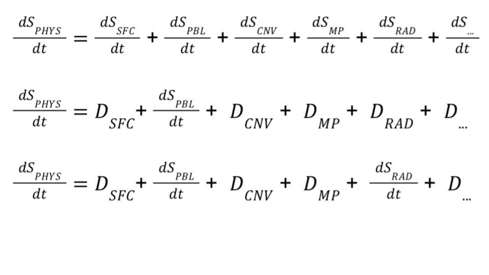
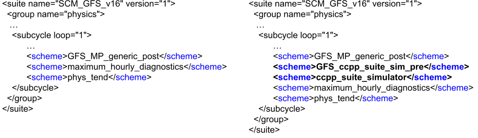
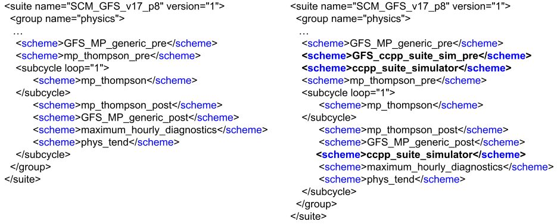

.. _`chapter: Hierarchical_Physics_Development`:

Hierarchical Physics Development
================================

:numref:`Chapter %c <Hierarchical Physics Development>` provides an overview of
the tools supported by the Single Column Model (SCM) to faciliate
hierarchical system development (HSD)

Background
----------

Developing and implementing a new physics parameterization for use in an
operational setting requires extensive testing and evaluation. This is
to ensure that new developments aren’t yielding unexpected results and
that all computational considerations are being met. From a scientific
perspective, this process should be incremental and hierarchical, i.e.
using HSD which follows a systems-engineering approach, i.e. initial
testing of simple idealized cases that focus on small elements (e.g.,
physics schemes) of an Earth System Model (ESM) first in isolation, then
progressively connecting elements with increased coupling between ESM
components at the different HSD steps. HSD includes SCMs (including
individual elements within the SCM), Small-Domain, Limited-Area and
Regional Models, all the way up to complex fully-coupled ESMs with
components for atmosphere/chemistry/aerosols, ocean/waves/sea-ice,
land-hydrology/snow/land-ice, and biogeochemical cycles/ecosystems, a
subset of which (i.e. atmosphere+land and specified ocean conditions)
has traditionally addressed Numerical Weather Prediction (NWP) needs.
HSD is end-to-end in that it includes data ingest and quality control,
data assimilation, modeling, post-processing, and verification. The
requirements for advancing from one HSD step to the next are appropriate
metrics/benchmarks for ESM (or ESM components or elements) performance,
many of which are at the physical process level, plus the necessary
forcing data sets to drive and validate models. Datasets for use in
different HSD steps are obtained from measurements (e.g. field programs
and observational networks), ESM output, or idealized conditions (often
used to “stress-test” schemes/elements/system components, among many
other options). It is important to note that the HSD process is
concurrent and iterative, i.e. more complex HSD steps can provide
information to be used at simpler HSD steps, and vice versa. This also
includes understanding spatial and temporal dependencies in model
physics, and the need for consistency in those solutions in models
between higher-resolution/regional short-range, global
medium/extended-range, and subseasonal-to-seasonal time scales.

The CCPP-SCM provides developers working within CCPP-compliant host
models the ability to test their physics innovations without having to
worry about the coupling to the dynamical core. This is a critical step
in the model development hierarchy, providing insight on how an
introduced physics change can modify the evolution of the internal
physics state. However, there are still challenges, most notably the
interactions between introduced changes and the other physics schemes in
the suite.

CCPP Suite Simulator
--------------------

Overview
~~~~~~~~

The CCPP Suite Simulator is a CCPP-compliant physics scheme that
provides the ability to turn on/off physical processes in a Suite
Definition File (SDF), using namelist options. This simulator
‘piggybacks’ on an existing SDF, replacing physics tendencies with
data-driven tendencies (Figure :numref:`CSS_tendency_schematic`).

.. _CSS_tendency_schematic:

   Equation for internal physics state evolution for process-split
   physics suite, where S is the prognostic state and D are simulated
   data tendencies. Top) Standard Suite Definition File; Middle) Active
   PBL physics with simulated tendencies for other schemes; Bottom)
   Active PBL and radiation, with simulated tendencies for other
   schemes.

Process-split vs. Time-split Physics Process
~~~~~~~~~~~~~~~~~~~~~~~~~~~~~~~~~~~~~~~~~~~~

Process-split physics processes are schemes that share a common input
state, whereas time-split processes use the state provided by the
previous physics process. A SDF can be any combination of time-split and
process-split schemes, just as long as the appropriate interstitial
schemes are created to couple the physics schemes.

About the CCPP Suite Simulator
~~~~~~~~~~~~~~~~~~~~~~~~~~~~~~

The CCPP Suite Simulator (CSS) emulates the evolution of the internal
physics state provided by the SDF. There are different deployments of
the suite simulator, depending on the role(s) and order of the physical
processes in the SDF we are emulating (e.g. time vs. process-split),
that need further attention. For instance, SDFs consisting of only
process-split physics schemes can be handled simply by adding the
simulator to the end of the SDF, since for process-split schemes the
order is not critical to the evolution of the internal physics state. On
the other hand, for SDFs that contain time-split processes, where the
simulator is added is important to preserve the order of the internal
state evolution.

.. _`pydepend_css`:

Python Dependencies
~~~~~~~~~~~~~~~~~~~

The scripts here require a few python packages that may not be found by
default in all python installations. There is a YAML file with the
python environment needed to run the script in ``ccpp-scm/environment_suite_sim.yml``. To create and activate
this environment using conda:

Create environment (only once):

.. code:: bash
   
  > conda env create -f environment-suite-sim.yml

This will create the conda environment ``scm_suite_sim``

Activate environment:

.. code:: bash

  > conda activate scm_suite_sim

Enabling the CCPP Suite Simulator
~~~~~~~~~~~~~~~~~~~~~~~~~~~~~~~~~

To use the CSS in the CCPP-SCM three modifications need to be made:

#. Add CSS, and any interstitial schemes needed for coupling the CSS to
   the host (e.g. SCM), to an existing CCPP SDF (or create a new SDF).

#. Set ``do_ccpp_suite_sim = .true.`` in the GFS physics namelist, ``gfs_physics_nml``

#. Modify, or create new, namelist that has the options needed to
   activate the CSS.

Modifying the CCPP Suite Definition File
~~~~~~~~~~~~~~~~~~~~~~~~~~~~~~~~~~~~~~~~

The SDF needs to be modified to include the CSS scheme, and any
interstitial schemes needed for your host application. Here we will
illustrate how to use the CSS within SCM (UFS) physics, for which all
applications use a physics SDF with a mixture of process-split and
time-split physics schemes. In general,

-  for SDFs that contain ONLY process-split schemes, the CSS can be
   added to the end of the SDF for all configurations. In this case we
   have the flexibility to switch “on/off” any combination of active
   physics and simulated physics at runtime, via namelist, with the same
   modified SDF.

-  when using SDFs that contain ONLY time-split schemes, the CSS needs
   to be added before and after each scheme you want to switch “on/off”.
   So one could add calls to the CSS between each process in the SDF to
   obtain total flexibility, or just around the schemes they are
   interested in.

In the examples below we will demonstrate how to modify SDFs to use the
CSS for SCM (UFS) physics applications,
:numref:`Section %s <Suite_with_Active_Radiation>` and :numref:`Section %s <Suite_with_Active_cldmp>`.

Namelist for the CCPP Suite Simulator
~~~~~~~~~~~~~~~~~~~~~~~~~~~~~~~~~~~~~

The CSS has its own namelist, ``ccpp_suite_sim_nml``, that needs to be added to the physics
namelists used by the SCM.

.. _lst_css_nml_ex1:
.. literalinclude:: css_nml.txt
    :caption: Example namelist for CCPP Suite Simulator.

-  ``suite_sim_file``: Input file with simulated data tendencies (See
   :numref:`Section %s <Creating_Custom_Data_for_Simulator>` for how to
   create input file from SCM output).

-  ``nprc_sim``: Number of physical processes in the input data.

-  ``prc_XYZ_cfg``: Configuration for physical process XYZ.

   -  0 - Active scheme; 1 - Use data

   -  0 - Process-split scheme; 1 - Time-split scheme

   -  Index for scheme order (1 - ``nprc_sim``)

For example, in Listing :numref:`lst_css_nml_ex1`, there
are two active schemes, longwave and shortwave radiation, and five
simulated schemes: PBL, gravity-wave drag, deep/shallow convection, and
cloud microphysics. The radiation, gravity-wave drag and PBL schemes are
all process-split, whereas convection and cloud microphysics are
time-split.

.. _`Creating_Custom_Data_for_Simulator`:

Creating Custom Data for Simulator
~~~~~~~~~~~~~~~~~~~~~~~~~~~~~~~~~~

Navigate to ``ccpp-scm/scm/etc/scripts/ccpp_suite_sim``

Provided with the SCM are scripts to generate data for the suite
simulator using output from a previous SCM run. The first script, ``create_1D_CSSdata.py``,
extracts the physics tendencies from a user-specified time interval,
which are used for constant forcing in the suite simulator. The other
script, ``create_2D_CSSdata.py``, creates a two-dimensional forcing dataset. The suite simulator
interpolates these forcings in time.

#. Run the SCM twice using the TWPICE case with the ``GFS_v16`` and ``GFS_v17_p8`` suites.

   .. code:: bash

      cd ccpp-scm/scm/bin
      ./run_scm.py -c twpice -s SCM_GFS_v16
      ./run_scm.py -c twpice -s SCM_GFS_v17_p8

#. Create 2D forcing data for the CSS, using SCM output from TWPICE case
   with ``GFS_v16`` suite.

   .. code:: bash

      cd ccpp-scm/scm/etc/scripts/ccpp_suite_sim
      ./create_2D_CSSdata.py --cases twpice --suites SCM_GFS_v16

#. Create constant forcing data for the CSS, using SCM output, at
   forecast time 3600s, from TWPICE case with ``GFS_v17_p8`` suite.

   .. code:: bash

      cd ccpp-scm/scm/etc/scripts/ccpp_suite_sim
      ./create_1D_CSSdata.py --cases twpice --suites SCM_GFS_v17_p8 --time 3600

The data file will be written to ``ccpp-scm/scm/etc/scripts/ccpp_suite_sim/`` with the format ``data_CSS_DIM.CASES.SUITES.nc``

.. _`Suite_with_Active_Radiation`:

Example 1: Suite with Active Radiation
~~~~~~~~~~~~~~~~~~~~~~~~~~~~~~~~~~~~~~

For this example we will use the two-dimensional forcing data from
:numref:`Section %s <Creating_Custom_Data_for_Simulator>`

First, we need to modify the SDF to include the CSS, ``ccpp_suite_simulator.F90`` and an additional
interstital scheme to couple to the GFS physics, ``GFS_ccpp_suite_sim_pre.F90`` (See
Figure :numref:`CSS_SDF_ex1`).

.. _CSS_SDF_ex1:

   Changes to GFS v16 physics SDF to include CCPP suite simulator for
   radiation parameterization. All other parameterizations are replaced
   by simulated data.

Next, the physics namelist needs to be configured to:

#. Add data file, created in :numref:`Section %s <Creating_Custom_Data_for_Simulator>`
   to the namelist.

#. Turn “off” all schemes except the radiation (see Listing
   :numref:`lst_css_nml_ex1`)

Finally, we rebuild the SCM with the modified SDFs to include the CSS,
and run the SCM using TWPICE case with the modified suite.

.. code:: bash

   cd ccpp-scm/scm/bin
   cmake ../src -DCCPP_SUITES=SCM_GFS_v16
   ./run_scm.py -c twpice -s SCM_GFS_v16

.. _`Suite_with_Active_cldmp`:

Example 2: Suite with Active Cloud Microphysics
~~~~~~~~~~~~~~~~~~~~~~~~~~~~~~~~~~~~~~~~~~~~~~~

For this example we will use the constant forcing data from
:numref:`Section %s <Creating_Custom_Data_for_Simulator>`

First, we need to modify the SDF to include the CSS, and an additional
interstital scheme to couple to the GFS physics, (See
Figure :numref:`CSS_SDF_ex2`).

.. _CSS_SDF_ex2:

   Changes to GFS v17 Prototype 8 physics SDF to include CCPP suite
   simulator for cloud microphysics parameterization. All other
   parameterizations are replaced by simulated data.

Next, the physics namelist needs to be configured to:

#. Add data file ``suite_sim_file`` created in
   :numref:`Section %s <Creating_Custom_Data_for_Simulator>` to the namelist.

#. Turn “off” all schemes except the cloud microphysics (see Listing
   :numref:`lst_css_nml_ex2`)

.. _lst_css_nml_ex2:
.. literalinclude:: css_nml_ex2.txt
    :caption: Example namelist for CCPP Suite Simulator with active cloud microphysics.

Finally, we rebuild the SCM with the modified SDFs to include the CSS,
and run the SCM using TWPICE case with the modified suite.

.. code:: bash

   cd ccpp-scm/scm/bin
   cmake ../src -DCCPP_SUITES=SCM_GFS_v17_p8
   ./run_scm.py -c twpice -s SCM_GFS_v17_p8

.. _`plotting_tools`:

Plotting tools
~~~~~~~~~~~~~~

Additionally, plotting scripts provided in :

#. .. code:: bash

      ./plt_scmout_2d.py [-h] -n CASE_NAME -sdf SDF -nmls NMLS -vars VAR1 VAR2 VAR3

   Mandatory arguments:

   #. ``--case_name (-n)`` name of case

   #. ``--suite (-sdf)`` CCPP suite definition file

   #. ``--nml_list (-nmls)`` namelists, separated by a space

   #. ``--var_list (-vars)`` varaibles to plot, separated by a space

#. .. code:: bash

      ./plt_scmout_3d.py [-h] -n CASE_NAME -sdf SDF -nmls NMLS -vars VAR1 VAR2 VAR3 -time TIME

   Mandatory arguments:

   #. ``--case_name (-n)`` name of case

   #. ``--suite (-sdf)`` CCPP suite definition file

   #. ``--nml_list (-nmls)`` namelists, separated by a space

   #. ``--var_list (-vars)`` variables to plot, separated by a space

   #. ``--time_plot (-time)`` time to plot, in seconds
